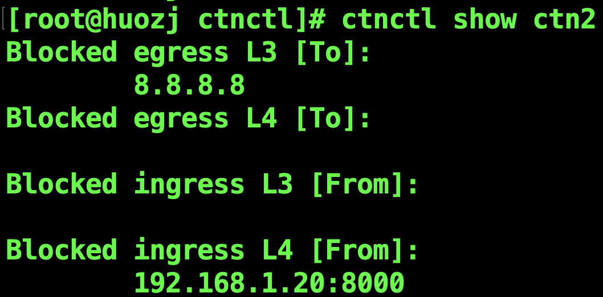
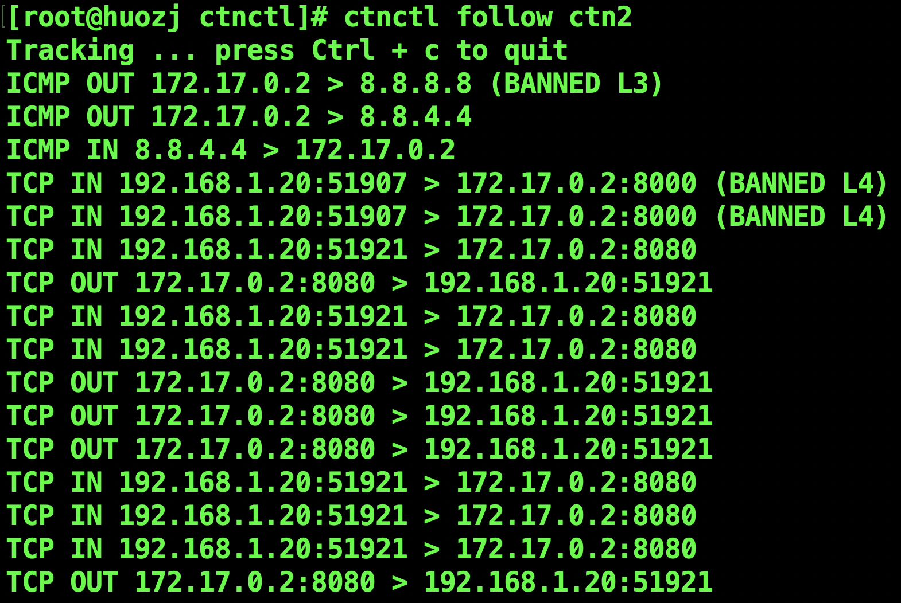

# Migrated from [my ciliumlearn project](https://github.com/ZhengjunHUO/ciliumlearn/tree/main/ebpf/ctnctl
# Apply firewall rules to docker container by attaching eBPF program to its cgroups

### Developed and tested under:
- Fedora 32 kernel 5.11.22-100.fc32.x86_64
```bash
dnf install make glibc-devel.i686 elfutils-libelf-devel wget tar vim tmux jq systemtap-sdt-devel clang bcc bcc-devel strace git llvm
```
- Go version 1.17.3
- Cgroup v2
- Docker version 20.10.7 (Cgroup driver: systemd)
- container's cgroup path: /sys/fs/cgroup/system.slice/docker-xxx.scope/

// TODO: add compatibility to elder kernel ; cgroups v1 ; different os/arch

## Switch to cgroup v2 & disable cgroup v1
```
sed -i -e 's/^GRUB_CMDLINE_LINUX=""/GRUB_CMDLINE_LINUX="systemd.unified_cgroup_hierarchy=1 cgroup_no_v1=all"/' /etc/default/grub
update-grub
```

## Build
```bash
make
cp ctnctl /usr/local/bin/ctnctl
```

## Usage
```bash
ctnctl -h
Apply firewall rules to container based on eBPF Cgroups

Usage:
  ctnctl [command]

Available Commands:
  block       Add an ip to container's blacklist
  clear       Clear container's firewall rules
  completion  Generate the autocompletion script for the specified shell
  follow      Print out the container's traffic flow
  help        Help about any command
  show        Show container's firewall rules
  unblock     Remove an ip from container's blacklist

Flags:
  -h, --help   help for ctnctl

Use "ctnctl [command] --help" for more information about a command.
```

## Example
```bash
# block an egress ip
ctnctl block -e 8.8.8.8 ctn
# block connection from 192.168.1.20 on port 8000
ctnctl block -i -t 192.168.1.20:8000 ctn
# check rules on ctn
ctnctl show ctn
```

```bash
# debug
ctnctl follow ctn 
```

```bash
# remove rule
ctnctl unblock -e 8.8.8.8 ctn
# remove all rules associated to container
ctnctl clear ctn
```
## Cleanup
```bash
make clean
```
